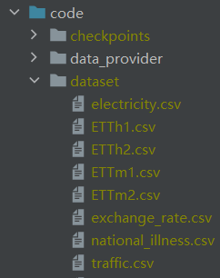
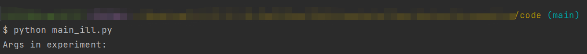

## DSTLinear——Decomposition Spatial-Temporal Linear

### 2022春 时间序列分析 大作业：多元时间序列预测

* 多元时间序列中，每个时间点有多个变量代表该时间点的状态信息。如何综合考虑多个变量之间的关系是多元时间序列分析中主要需要解决的问题
* 在多元时间序列预测任务中，需要根据给定的多元时间序列预测一个或多个变量的未来值，下图展示了预测多个变量的场景
  

* [这篇文章](https://arxiv.org/pdf/2205.13504.pdf)
  将多元时间序列看作多个一元时间序列，忽略了变量之间的关系，本项目基于该文章及其代码，设计一种考虑多个变量之间关系的预测模型：[DSTLinear](code/models/DSTLinear.py)
* DSTLinear具体结构设计参见[这篇报告](DSTLinear.pdf)

### How to Run

#### 1.模型效果

1. 将数据集放置在`/code/dataset`目录下
    * 
2. 命令行运行`python main_{dataset}.py`
    * 将`{dataset}`替换为对应的数据集即可
    * 

#### 2.模型复杂度

* 命令行运行`python main_complixity.py`