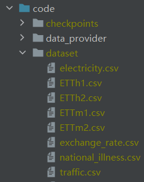
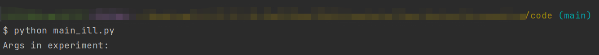

## DSTLinear——Decomposition Spatial-Temporal Linear

### 多元时间序列预测

### How to Run

#### 1.模型效果

1. 将数据集放置在`/code/dataset`目录下
    * 
2. 命令行运行`python main_{dataset}.py`
    * 将`{dataset}`替换为对应的数据集即可
    * 

#### 2.模型复杂度

* 命令行运行`python main_complixity.py`